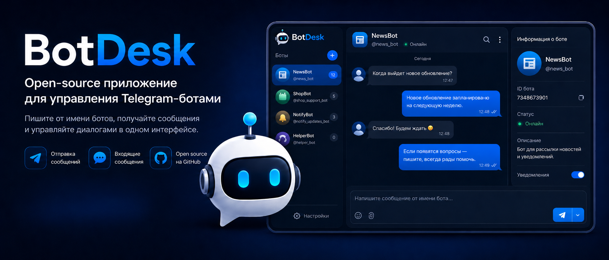

<p align="center">
  
</p>

<h1 align="center">BotDesk</h1>

<p align="center">
  Open-source desktop-приложение для управления Telegram-ботами, входящими диалогами и ответами из одного аккуратного интерфейса.
</p>

<p align="center">
  <a href="https://github.com/nekotyy/tg-bot-manager/actions/workflows/ci.yml">
    
  </a>
  <a href="https://github.com/nekotyy/tg-bot-manager/releases/latest">
    
  </a>
  <a href="LICENSE">
    
  </a>
</p>

## Что это

BotDesk помогает отвечать пользователям Telegram-ботов без отдельной админки, серверов-посредников и лишней рутины. Добавь токен из BotFather, выбери бота, открой диалог и отвечай от его имени.

Приложение работает локально: токены хранятся на компьютере, запросы идут напрямую в Telegram Bot API, а полученная история сохраняется в локальном хранилище Electron.

## Возможности

- Подключение до 15 Telegram-ботов.
- Фоновое получение входящих через `getUpdates`.
- Локальная история входящих и исходящих сообщений.
- Поддержка текста, фото, видео, кружков, голосовых сообщений и стикеров.
- Отправка сообщений от имени выбранного бота.
- Список диалогов с аватарками, непрочитанными и последним сообщением.
- Поиск по имени, username и Telegram ID.
- Открытие доступного диалога по user ID.
- Шифрование токенов через Electron `safeStorage`.
- Portable-версия и Windows installer в релизах.

## Скачать

Готовые сборки лежат в [GitHub Releases](https://github.com/nekotyy/tg-bot-manager/releases/latest).

| Файл | Для чего |
| --- | --- |
| `BotDesk-Portable-<version>.exe` | Запуск без установки |
| `BotDesk-Setup-<version>.exe` | Обычная установка в Windows |

## Быстрый старт

1. Скачай portable или installer из последнего релиза.
2. Запусти BotDesk.
3. Создай бота или возьми токен существующего у [@BotFather](https://t.me/BotFather).
4. Добавь токен в BotDesk.
5. Открой диалог и отвечай пользователям.

## Ограничения Telegram Bot API

Telegram не разрешает боту первым начинать личный диалог. Открытие чата по ID сработает только если пользователь уже взаимодействовал с ботом и чат доступен через Bot API.

Bot API не отдаёт полную старую историю сообщений. BotDesk сохраняет локально сообщения, которые получил после подключения бота, и исходящие сообщения из приложения.

Если у бота включён webhook в другом сервисе, `getUpdates` будет недоступен. Для фоновой синхронизации webhook нужно отключить или использовать отдельный мост доставки updates.

## Разработка

Требования:

- Node.js 20+
- Windows 10/11

```powershell
npm install
npm run dev
```

Проверки:

```powershell
npm run typecheck
npm run lint
npm run build:web
```

Полная Windows-сборка:

```powershell
npm run build
```

После сборки артефакты появятся в `release/`.

## CI/CD

В репозитории настроены GitHub Actions:

- `CI` запускает typecheck, lint и web build на push/PR.
- `Release` собирает Windows portable и installer на тегах `v*`.
- Артефакты автоматически прикладываются к GitHub Release.

Пример публикации:

```powershell
git tag v1.1.0
git push origin v1.1.0
```

## Где хранятся данные

- Состояние: Electron `userData`, файл `botdesk-state.json`.
- Медиа-кэш: Electron `userData/media`.
- Токены: локально, с шифрованием через Electron `safeStorage`, когда оно доступно.

## Лицензия

BotDesk распространяется под лицензией [MIT](LICENSE).
